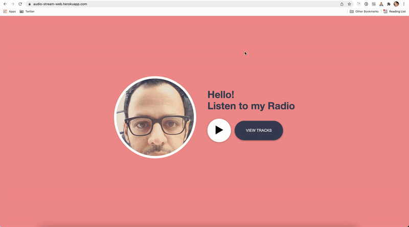
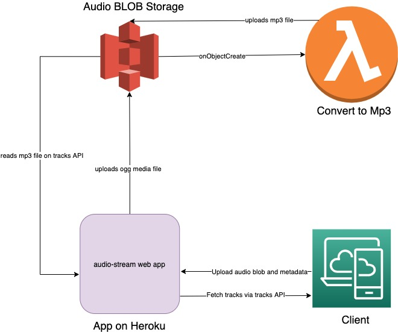

# audio-stream



POC for testing Audio recording and streaming on web.


## Installation

You need node > 12 and `yarn` to run the app.

Run `yarn install`.

## Running the app

### Locally

1. Normally if you don't need media persistance you can just do `yarn dev`

2. If you want to persist the media

```sh
$ export AWS_PROFILE="name-of-your-aws-profile"
$ export MEDIA_PERSIST_S3_BUCKET_NAME="name-of-s3-bucket"
$ yarn dev
```

Go to http://localhost:9999/record to record and http://localhost:9999/ to listen. You can start recording and then opening the listen page and press play to hear the stream in real-time.

## Deployment

Currently the app is deployed on Heroku. There is no CI/CD setup at the moment so the deployment happens from a local machine. The current live URL is:

https://audio-stream-web.herokuapp.com/

## Infrastructure

1. **Heroku**: Hosts the web app and at the moment the deployment is not automated
2. **AWS**: Hosts the Lambda function which converts `.ogg` audio files on the S3 Blob store to `.mp3`. This function is provisioned by Pulumi and the process to deploy it automated on Github workflow actions.

## High level Architecture



The current web application is written using vanilla Node.js. It exposes http endpoints which act both as a rough RESTFul API as well as page endpoints which serve HTML and Javascript client code. The client-side code is also written in vanilla JS and there is no additional UI library or Framework either for CSS or JS.

The main design pattern used in the Node app is based on Clean Architecture principals which separate framework/infra code (e.g interaction with Blob storage) from interface adapters (e.g. controllers) and internal domain and business logic (mainly use cases). There are mainly two workflows one of which is for recording tracks and live streams and the other one is for consuming the live stream and playing tracks.

"Audio stream" web app also persists the recorded tracks and uploads them to AWS S3 Blob storage. This is done using a custom-build `WorkerPool` class which under the hood uses `Worker` from `worker_thread`. At the moment the pool size is 20 which means we can handle 20 media uploads at the same time and not create over-head in the main Node app thread.

There is also a Lambda serverless micro-service responsible for converting the uploaded objects from `ogg` which is the web format to `mp3`. The `convertToMp3` function is also written in Node and runs in the [AWS Lambda container run-time](https://docs.aws.amazon.com/lambda/latest/dg/runtimes-images.html). This means that we manage a Docker image which is mainly concerned with running Node and also uses `ffmpeg` under the hood for audio conversion. It then uploads the formatted audio back to the same S3 bucket which is queries by the app to fetch tracks and show it on the web client.

Currently the web app runs on Heroku using a free dyno. So it will die occasionally when no traffic is sent to it and the boot up might take some seconds.
