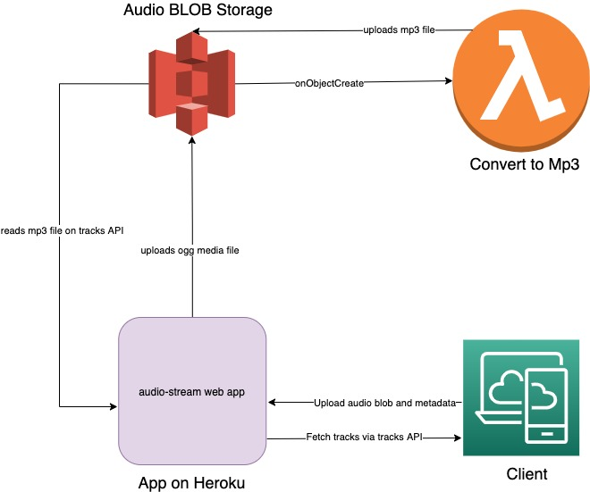

# audio-stream

POC for testing Audio recording and streaming on web.

## Installation

You need node > 12 and `yarn` to run the app.

Run `yarn install`.

## Running the app

### Locally

1. Normally if you don't need media persistance you can just do `yarn start`

2. If you want to persist the media

```sh
$ export AWS_PROFILE="name-of-your-aws-profile"
$ export MEDIA_PERSIST_S3_BUCKET_NAME="name-of-s3-bucket"
$ yarn start
```

Go to http://localhost:9999/record to record and http://localhost:9999/ to listen. You can start recording and then opening the listen page and press play to hear the stream in real-time.

## Deployment

Currently the app is deployed on Heroku. There is no CI/CD setup at the moment so the deployment happens from a local machine. The current live URL is:

https://audio-stream-web.herokuapp.com/

## Infrastructure

1. Heroku: Hosts the web app and at the moment the deployment is not automated
2. AWS: Hosts the Lambda function which converts `.ogg` audio files on the S3 Blob store to `.mp3`. This function is provisioned by Pulumi and the process to deploy it automated on Github workflow actions.

## High level Architecture


